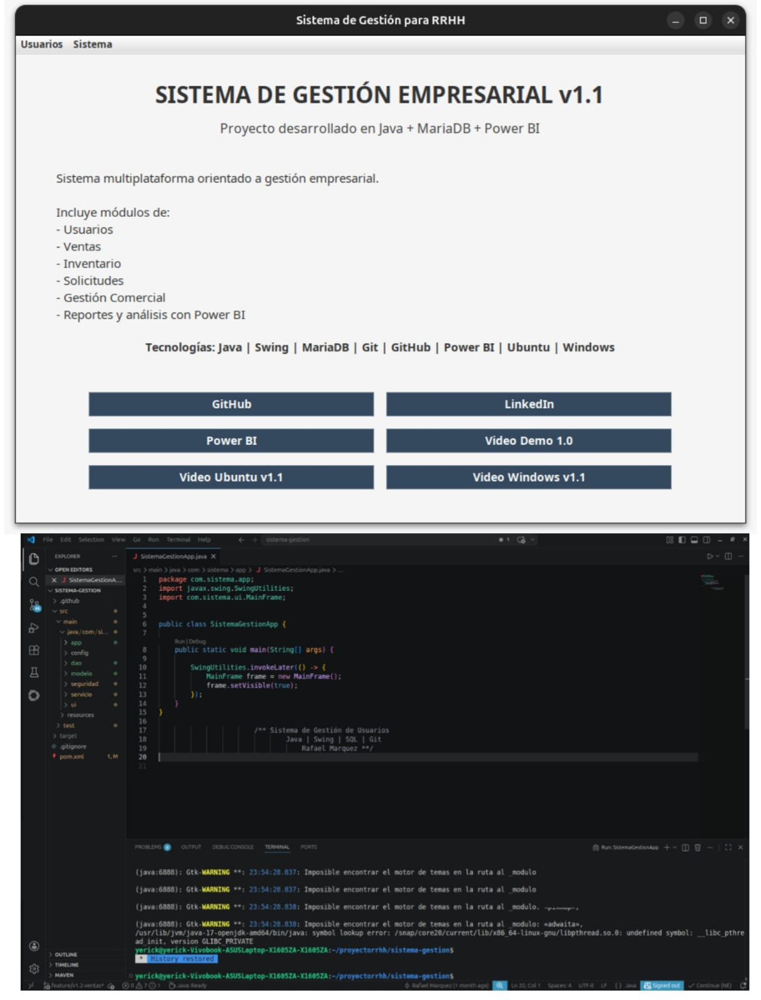
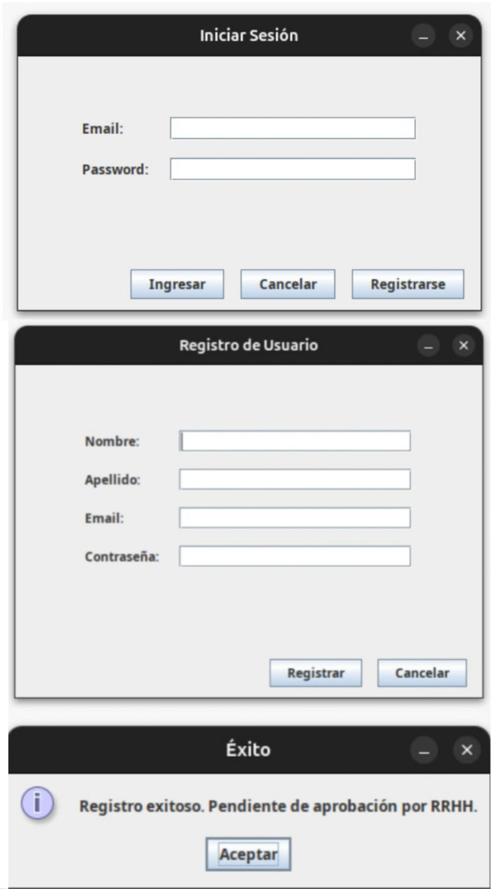
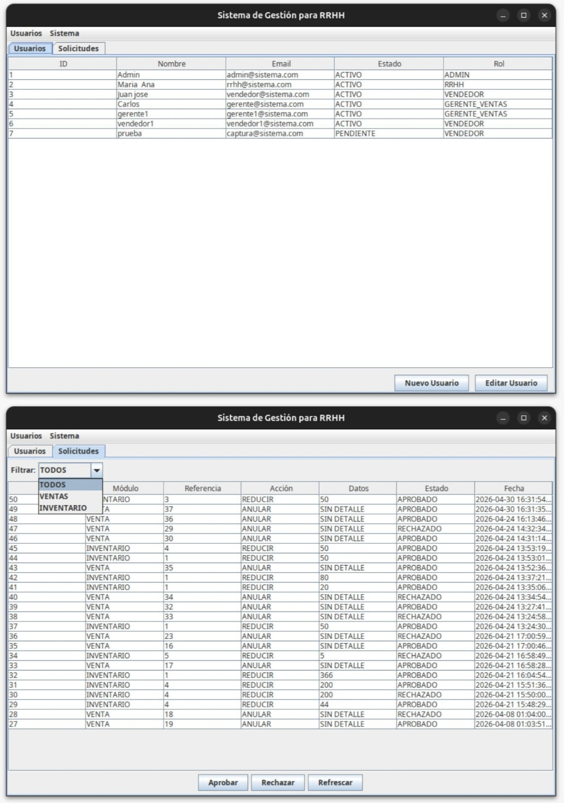
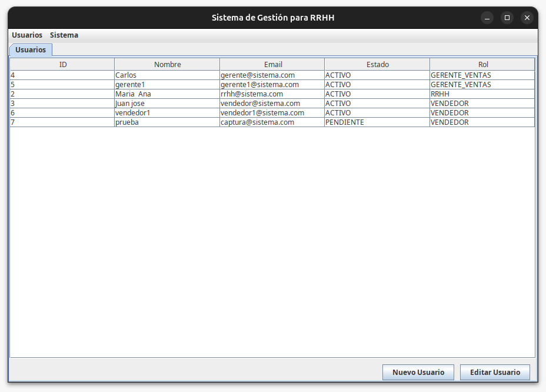
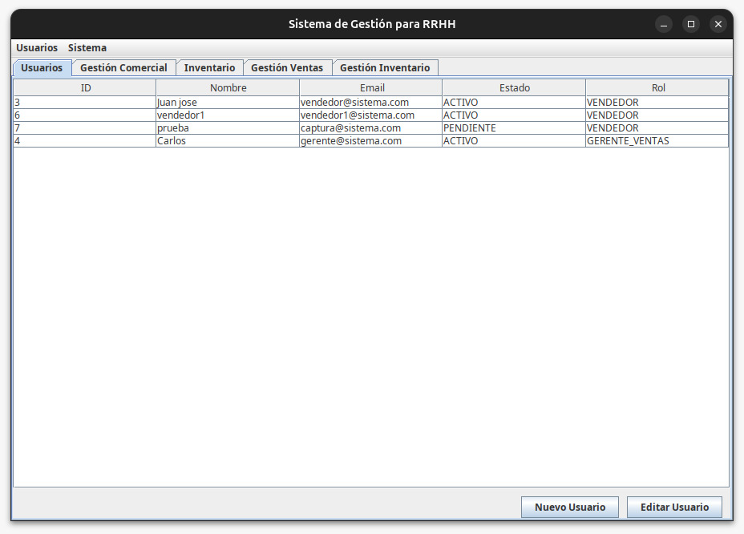
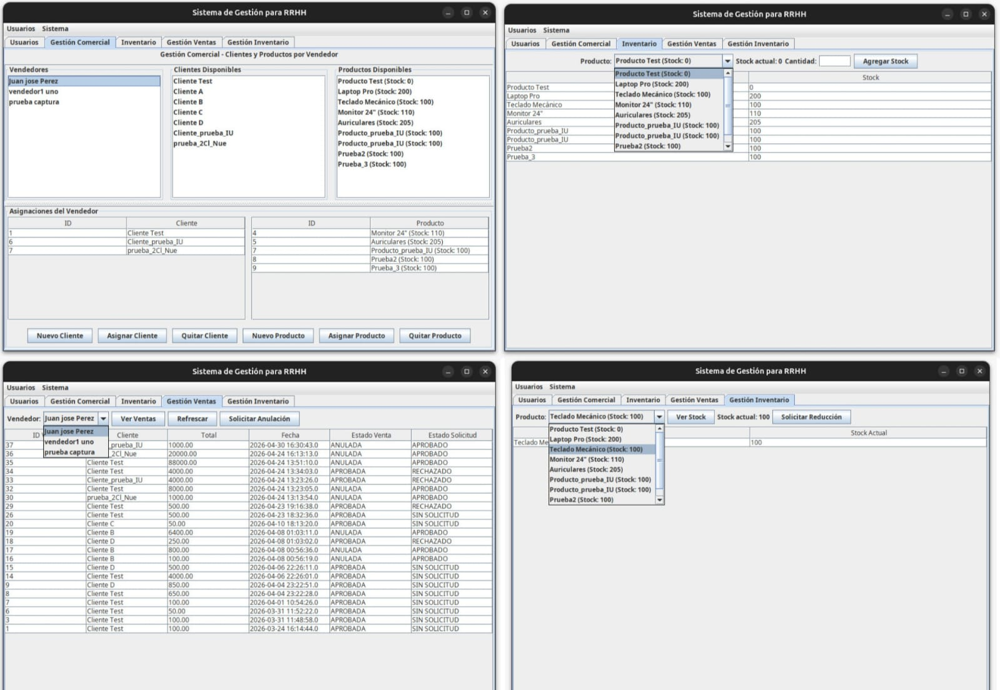
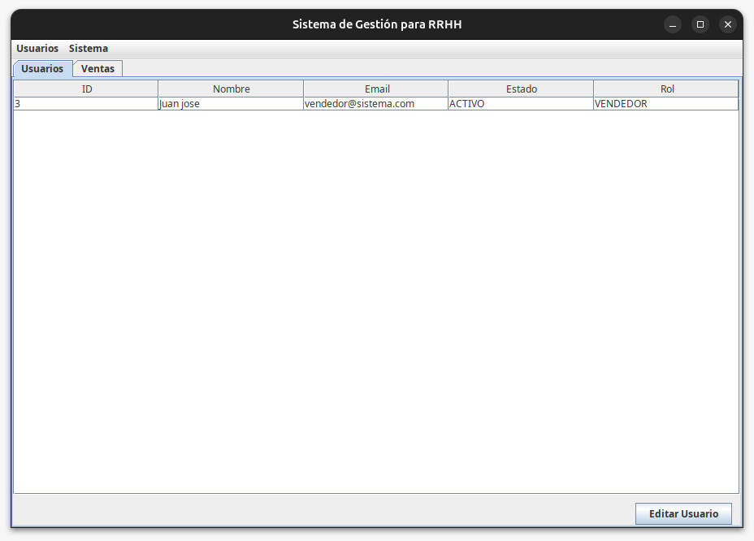
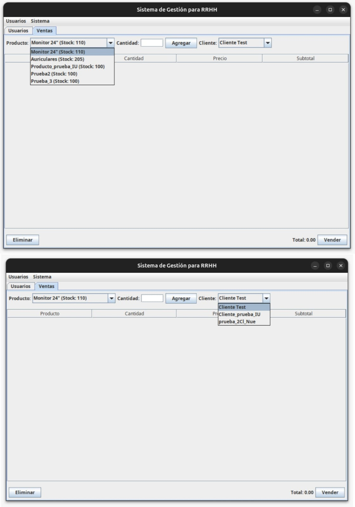
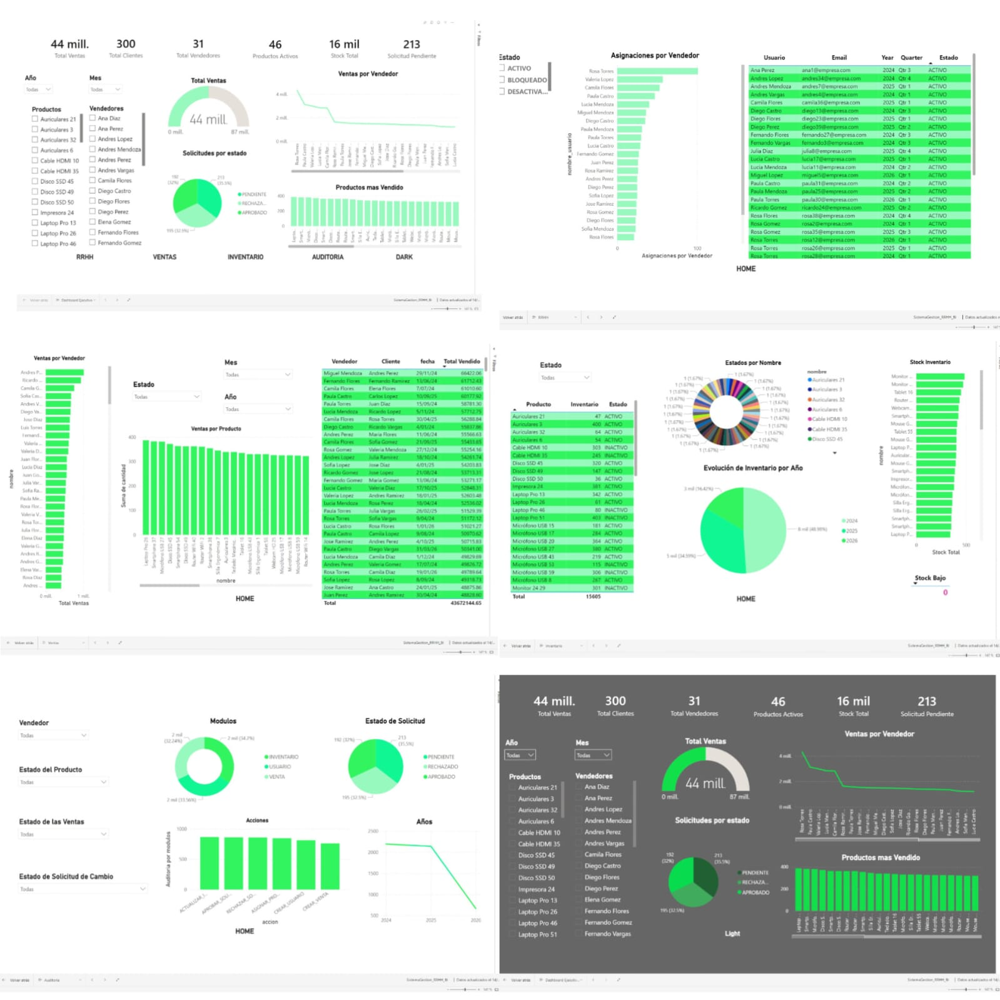

# Sistema de Gestión Empresarial v1.1

## Descripción del Proyecto

Sistema de gestión empresarial desarrollado en Java orientado a RRHH, ventas, inventario y análisis de información.

El proyecto evolucionó desde una versión inicial enfocada en autenticación y gestión de usuarios hacia una solución empresarial más completa, incorporando módulos comerciales, persistencia avanzada y visualización de datos mediante Power BI.

La aplicación fue desarrollada utilizando arquitectura por capas, conexión a base de datos MariaDB/MySQL y control de versiones con Git y GitHub.

---

# Tecnologías Utilizadas

* Java
* Java Swing
* MariaDB / MySQL
* Maven
* Git & GitHub
* Power BI
* Ubuntu
* Windows
* Visual Studio Code

---

# Funcionalidades Principales

## Gestión de Usuarios

* Inicio de sesión
* Control por roles
* Validación de usuarios
* Gestión administrativa

## Gestión Comercial

* Registro de ventas
* Control de inventario
* Persistencia de productos
* Gestión de solicitudes
* Validaciones empresariales

## Inventario

* Inventario compartido
* Actualización de stock
* Gestión centralizada
* Flujo de validaciones

## Power BI

* Integración analítica
* Dashboard ejecutivo
* Reportes de ventas
* Visualización de información empresarial

---

# Arquitectura del Proyecto

El sistema fue desarrollado utilizando arquitectura por capas:

## Modelo

Representación de entidades del sistema.

## DAO

Persistencia y consultas SQL.

## Servicio

Lógica de negocio y validaciones.

## UI

Interfaz gráfica desarrollada con Java Swing.

---

# Capturas del Sistema

## Panel Principal



## Login



## Gestión de Usuarios

## Gestión Solicitudes



## Gestión RRHH



## Gestión Ventas e Inventario




## Gestión Venta




## Power BI



---

# Videos del Proyecto

## Video Demo v1.0

[https://www.youtube.com/watch?v=jih3bNQ8UdI](https://www.youtube.com/watch?v=jih3bNQ8UdI)

## Video Ubuntu v1.1

Próximamente disponible.

## Video Windows + Power BI v1.1

Próximamente disponible.

---

# Power BI Dashboard

[https://app.powerbi.com/groups/me/reports/8a5e2020-15a6-4af8-8595-be4e50deb41b/a5a71bfffa2413879405?experience=power-bi](https://app.powerbi.com/groups/me/reports/8a5e2020-15a6-4af8-8595-be4e50deb41b/a5a71bfffa2413879405?experience=power-bi)

---

# GitHub

[https://github.com/alejandrconductor-sys/sistema-gestion-usuarios-java](https://github.com/alejandrconductor-sys/sistema-gestion-usuarios-java)

---

# LinkedIn

[https://www.linkedin.com/in/rafael-alejandro-marquez-araujo-4276093b7/](https://www.linkedin.com/in/rafael-alejandro-marquez-araujo-4276093b7/)

---

# Instalación y Ejecución

## Clonar repositorio

```bash
git clone https://github.com/alejandrconductor-sys/sistema-gestion-usuarios-java.git
```

## Abrir proyecto

Abrir el proyecto en Visual Studio Code.

## Ejecutar

Compilar y ejecutar el proyecto utilizando Maven.

---

# Evolución del Proyecto

## Versión 1.0

* Sistema RRHH básico
* Gestión de usuarios
* Autenticación
* Roles
* Persistencia inicial

## Versión 1.1

* Gestión comercial
* Ventas
* Inventario compartido
* Solicitudes
* Integración Power BI
* Dashboard principal profesional
* Integración GitHub y documentación

---

# Objetivo del Proyecto

El objetivo principal fue construir un sistema empresarial orientado a escenarios reales de negocio, aplicando:

* Arquitectura por capas
* Persistencia de datos
* Validaciones empresariales
* Gestión de inventario
* Análisis de información
* Control de versiones
* Presentación profesional de proyecto

# Descarga y Pruebas

La carpeta `release/` contiene:

- Archivo ejecutable `.jar`
- Backup SQL de la base de datos
- Guía de ejecución local

Contenido:

release/
├── sistema-gestion-v1.1.jar
├── backup_bd_v1.1.sql
└── README_EJECUCION.txt

Esto permite probar el sistema de manera local.

---

# Desarrollador

Rafael Marquez

Desarrollador enfocado en Java, bases de datos y análisis de información empresarial.

